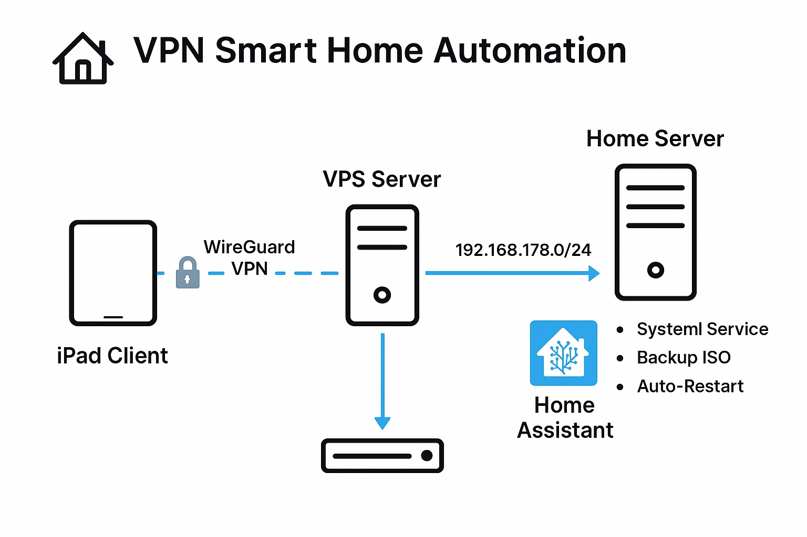

# 🏠 VPN Smart Home Automation

🌍 [🇬🇧 English](#-vpn-smart-home-automation) | [🇩🇪 Deutsch](#-vpn-smart-home-mit-wireguard-und-vps) | [🇷🇺 Русский](#-vpn-умный-дом-wireguard--vps)

---

## 🏠 VPN Smart Home Automation

Secure, monitorable remote access to your smart home using WireGuard VPN, systemd watchdogs, and ISO-based backup strategies.

### ✨ Features

- WireGuard VPN tunnel: iPad ⇄ VPS ⇄ Home Server
- systemd-based watchdog for connection monitoring
- ISO backup & restore automation
- Clean modular project layout

### 🧩 Architecture



See full tunnel structure and WireGuard setup: [docs/docs-wireguard-architecture-full.md](docs/docs-wireguard-architecture-full.md)

### ⚙️ Installation

```bash
sudo apt install wireguard ufw systemd
cp wireguard-setup/wg0.conf /etc/wireguard/
wg-quick up wg0
```

### 🔧 Technologies

WireGuard, systemd, bash, UFW, Home Assistant

---

## 🏠 VPN Smart Home mit WireGuard und VPS

Sicherer Remote-Zugriff auf Ihr Smart Home über ein WireGuard-VPN, vermittelt durch einen VPS. Ideal für Home Assistant, SSH-Zugriffe und Systemüberwachung.

### ✨ Funktionen

- WireGuard-Tunnel: iPad ⇄ VPS ⇄ Heimserver
- Systemd-basierte Überwachung & Neustart
- ISO-Backup & Wiederherstellung
- Zugriff auf das Heimnetzwerk (z. B. 192.168.x.x)

### 🧩 Architektur


Detaillierte Anleitung: [docs/docs-wireguard-architecture-full.md](docs/docs-wireguard-architecture-full.md)

### 🛠 Konfiguration

- VPS: `10.10.10.1`
- iPad: `10.10.10.2`
- Heimserver: `10.10.10.3`

Die Konfigurationsdateien befinden sich im Ordner `wireguard-setup/`

---

## 🏠 VPN Умный Дом: WireGuard + VPS

Надёжный и безопасный доступ к вашему умному дому через WireGuard-туннель. Используется промежуточный VPS-сервер и физический сервер дома, включая автоматизацию и резервное копирование.

### ✨ Возможности

- Туннель WireGuard: iPad ⇄ VPS ⇄ Домашний сервер
- Мониторинг соединения через systemd таймер
- Резервное копирование системы в ISO и восстановление
- Поддержка Home Assistant по VPN

### 🧩 Архитектура


Подробная инструкция: [docs/docs-wireguard-architecture-full.md](docs/docs-wireguard-architecture-full.md)

### 🛠 Конфигурации

- VPS получает IP: `10.10.10.1`
- iPad: `10.10.10.2`
- Домашний сервер: `10.10.10.3`

Конфиги находятся в `wireguard-setup/`

---

## 📬 Contact / Контакты

[LinkedIn — Serhii Yeroshko](https://www.linkedin.com/in/serhii-yeroshko)  
📧 Email: homeautodev@gmail.com
